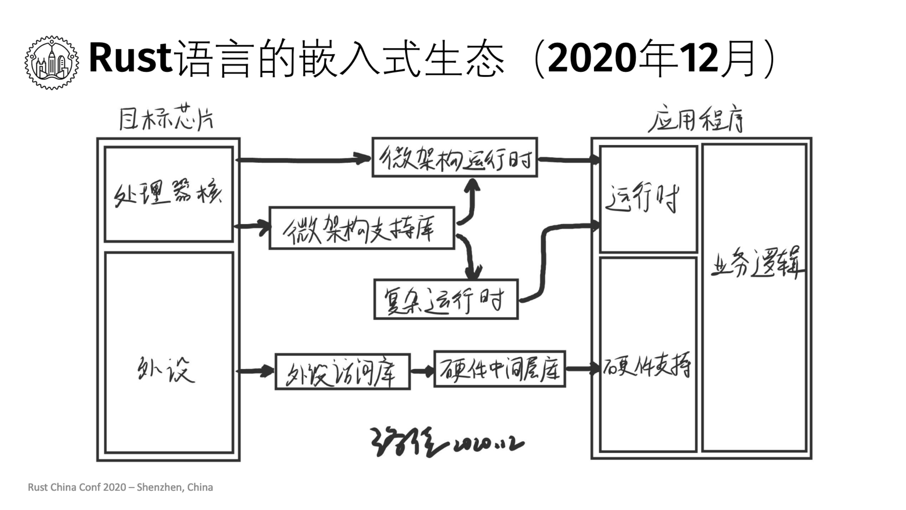

# 嵌入式领域的Rust语言

洛佳

Rust语言是二十一世纪的语言新星。Rust被人广泛承认的一点，就是因为它能运行在多样的目标上，
从桌面和服务器设备，到资源有限的嵌入式设备。

我们可以用适合来评价一门语言和技术。Rust非常适合开发嵌入式应用，它是一种和C相仿的，
能应用于嵌入式设备开发的编程语言。

操作系统都是从裸机设备开始运行的，Rust语言的这一点也意味着，它能很好地用于编写操作系统。
无论是应用层还是内核本身，Rust都是极富竞争力、值得投入时间的技术选项。

## 裸机上的Rust语言

Rust语言是编译型语言。它和解释运行的脚本语言不同，编译得到的结果直接是机器码。

todo

## 搭建Rust嵌入式生态

todo

## RustSBI：新型操作系统引导软件

我们在开发操作系统内核时，有的内核直接运行在裸机上，有的还依托于一个运行环境。
在RISC-V上，“SBI”就是这样的运行环境。它除了引导启动内核，还将常驻后台，提供操作系统需要的实用功能。

RISC-V标准中，“SBI”意味着“操作系统二进制接口”，运行在其上的操作系统会通过环境调用“ecall”指令，
陷入到二进制接口的实现中，由其调用具体硬件的实现功能。这种实现被称作“SBI实现”，社区常用的实现有开源的OpenSBI。
RustSBI是鹏城实验室“rCore代码之夏-2020”活动提出的SBI实现，它是全新的操作系统引导软件。

### 实现与模块组成

RustSBI由几个功能模块组成。硬件环境接口实现了RISC-V SBI v0.2版本的接口，能运行支持此版本的操作系统。
硬件运行时则是SBI实现运行在裸机环境的必要模块，它将由硬件启动，开始运行所有的RustSBI模块。
SBI的初始化完成后，将进入引导启动模块，这里将发挥SBI标准“引导启动”的功能，最终启动操作系统内核。
另外，兼容性模块能完成硬件到硬件间的支持，能模拟旧版硬件不存在的指令、寄存器，进一步延长操作系统的生命周期。

去年12月，RustSBI的0.1版本在深圳的Rust中国社区2020年年会上发布。使用目前最新的0.1.1版本，
RustSBI已经支持大量SBI标准提出的功能，支持大量自定义的扩展功能；完全使用安全的Rust语言编写，提高开发效率。
开发Rust语言的操作系统内核，可以统一编译工具链。另外，RustSBI已经被RISC-V组织收录入RISC-V SBI标准，
它的实现编号为4。

RustSBI是一个库，它以库的形式设计的初衷是，便于平台开发者“积木”式地引入库的模块，为自己的硬件目标开发SBI支持。
虽然RustSBI提供了QEMU、K210平台的参考实现，但应用开发者不应当将自己的目标也加入参考实现中，
而是在自己的仓库里引用RustSBI的模块，可以选择参考这些实现的内容，最终完成完全可控的开发过程。
这两个平台的使用范围较广，参考实现也会长期维护，以发现RustSBI本身可能的少量问题，并及时修补完善。

为什么用Rust开发RustSBI呢？我们认为，相比使用C语言，嵌入式Rust的生态圈在协调发展阶段，它容易支持新硬件，
Rust语言较强的编译约束也提高了硬件代码的安全性。

### 硬件到硬件的兼容性

RISC-V是快速更迭的指令集规范。我们为新版RISC-V硬件编写软件，会遇到与旧版硬件不兼容的情况。
硬件和硬件之间的兼容性，也能通过软件完成——这是RustSBI提供的功能与亮点之一。

RustSBI实现的硬件兼容性，是靠捕获指令异常完成的。例如，K210平台实现的是1.9.1版本的RISC-V特权级标准，
它规定了旧版的页表刷新指令；而目前最新的1.11版标准，规定的是新版的刷新指令。为新标准编写的操作系统内核，
使用新版刷新指令，会因为K210硬件无法找到新版指令，抛出非法指令异常。这个非法指令异常被RustSBI捕获，
它解析后，发现是新版的页表刷新指令，便直接在硬件上运行旧版的指令，完成指令的页表刷新功能。

这种硬件兼容性，目前能支持新增的指令和寄存器。一切情况下，指令、寄存器在仍然存在，但新版中修改了它们的功能和意义。
只靠RustSBI软件本身，就不足以提供兼容性支持了。如果RISC-V芯片实现提供特定的兼容性外设，
比如这个外设能拦截特定CSR寄存器的访问指令，就可以在功能修改的寄存器访问时，产生一个可供软件捕获的中断。
这样的外设设计之后，使用RustSBI软件，将能支持功能修改的指令和寄存器，将进一步提升操作系统内核的硬件兼容性。

兼容旧硬件，也是兼容未来新硬件的过程。未来的RISC-V标准快速发展，将与目前的硬件标准产生一定的差异；
在硬件不变的前提下，未来软件能对当前的硬件兼容，就能延长软件的生命周期。
或许，我们未来升级RISC-V上的操作系统，只需要更换硬件中的RustSBI固件，就能完美兼容最新标准的操作系统了。
升级原有系统的硬件也非常容易，替换RustSBI固件就能达到升级效果。

另外，硬件兼容性也意味着实现硬件上缺少的指令集。当这些指令集运行时，就会陷入到软件中，由RustSBI软件模拟这些指令，
最终返回，这个过程应用软件不会有感知。当然，这种软件模拟过程可以满足正确性，效率不如新版的硬件，
但临时运行一个新版的软件、体验新版的指令集还是足够的。当模拟指令的过程多到影响性能时，也就是硬件该升级的时候了。

### RustSBI与嵌入式Rust生态

在RustSBI的实现中，多次使用“embedded-hal”的实现完成编写过程。“embedded-hal”是Rust嵌入式的外设规范，
它对大量厂家的外设提供了软件支持。只要厂家的硬件支持“embedded-hal”，只需要编写部分抽象接口代码，
RustSBI支持就可以快速地开发完成。

我们也乐于看到在Rust生态的建设过程中，各个领域的互动也能加快生态的建设过程。“embedded-hal”本是裸机外设的标准，
RustSBI将这个标准运用在引导软件上，能加速裸机外设的开发和建设，也能更快适配SBI标准到平台上。
借这个项目，我们很高兴能参与嵌入式Rust的建设中，希望这些微小的技术更新和迭代，最终能回馈到我们美好的生活中去。
